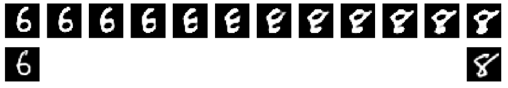
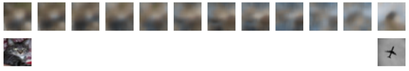

# HybridAnimalAutoencoders

This project aims to use autoencoders and various other nerual networks to create hybrid animals. Autoencoders can represent structured, high-dimensional data in a low-dimensional manifold. We want to create animal or other object hybrids by linearly interpolating in the encoded space between two animals or objects, to morph one into the other. Evaluation is done qualitatively, based on the presence of high and low level features present through the hybridization.

## Project Metadata

This project was created for:

- CSCI 5922: Neural Networks and Deep Learning

- Professor Nicholas Dronen

- Spring 2019

Our team consists of:

- Grant Baker ([grantbaker](https://github.com/grantbaker))
- Luke Meszar ([LukeMeszar](https://github.com/LukeMeszar))
- Max Schwarz ([masc7859](https://github.com/masc7859))
- Rachel Westerkamp ([RachelWesterkamp](https://github.com/RachelWesterkamp))

# Results

Below are some example results we obtained. First is a transformation from a 6 to an 8. These images are from the MNIST dataset (handwritten digits).

Although there is some blurring of the images, the digits are still distinguishable, and the semantic transformation is clear.

Here is an example of transformation from a cat to a plane. The images here are very blurry, almost to the point of unrecognizability. These images are from the CIFAR-10 dataset.

When training the encoder and decoder separately, we noted better results. This is another CIFAR-10 example of a transition from a cat to a deer using separete training.

# Discussion
We began by using the MNIST dataset to visually analyze the semantic transformation between two handwritten digits. Although the decoded digits were blurry, they were still distinguishable.

When we switched to the CIFAR-10 dataset, we employed two techniques: one in which the encoder and decoder were trained separately, and one where they were trained together. Separating the training improved the results.

The STL dataset results also showed the semantic transformation, with slightly more distinguishable results, perhaps as a result of the larger number of pixels in the original images.

On the stanford cars dataset, we implemented a segmentation technique where the background of the images was removed. This did not yield as improved results as we’d hoped.

High frequency features (the details) were hard to capture and recreate. General shapes persisted in output images, but details did not.

# Future Ideas
It would be useful to classify at each point in the transformation to see where the network switches from one class to another, or completely fails. One method for impriving image quality would to be acquire higher-resolution data, or by investigating addition segmentation methods. Applying super-resolution mothods or more sophisticated upsampling techniques could also help to improve the results.

# How to Reproduce

Put the scripts to reproduce the project here

To run the VAE models, use the following command: ./vae.sh $1 where $1 is either 0,1,2 and represents the datasets MNIST, CIFAR10, or CIFAR10 and Stanford Cars respectively.

# Trained Models

Due to GitHub file size restrictions, all of our saved models can be found [here](https://keybase.pub/grantbaker/saved_models).

# References

Bengio, Yoshua, et al. "Better mixing via deep representations." International conference on machine learning. 2013.

Coates, Adam, Andrew Ng, and Honglak Lee. "An analysis of single-layer networks in unsupervised feature learning." Proceedings of the fourteenth international conference on artificial intelligence and statistics. 2011.

Hasanpour, Seyyed Hossein, et al. "Lets keep it simple, Using simple architectures to outperform deeper and more complex architectures." arXiv preprint arXiv:1608.06037 (2016).

Krause, Jonathan, et al. "3d object representations for fine-grained categorization." Proceedings of the IEEE International Conference on Computer Vision Workshops. 2013.

Kolesnikov, Alexander, et al. "Closed-form approximate CRF training for scalable image segmentation." European Conference on Computer Vision. Springer, Cham, 2014.

Rifai, Salah, et al. "The manifold tangent classifier." Advances in Neural Information Processing Systems. 2011.
